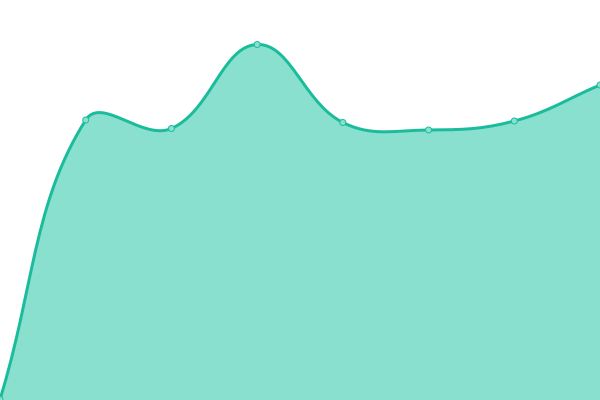
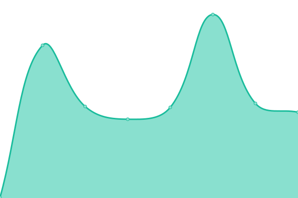
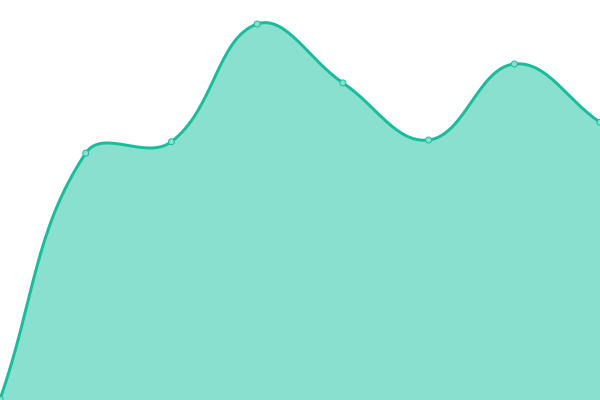
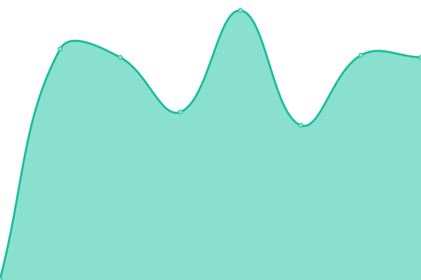
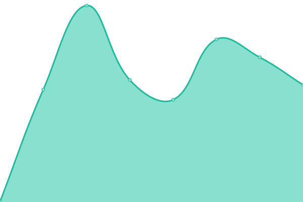

# [📈 Live Status](https://zvg.github.io/uptime): <!--live status--> **🟩 All systems operational**

This repository contains the open-source uptime monitor and status page for [zvg](https://zvg.github.io/uptime), powered by [Upptime](https://github.com/upptime/upptime).

With [Upptime](https://upptime.js.org), you can get your own unlimited and free uptime monitor and status page, powered entirely by a GitHub repository. We use [Issues](https://github.com/zvg/uptime/issues) as incident reports, [Actions](https://github.com/zvg/uptime/actions) as uptime monitors, and [Pages](https://zvg.github.io/uptime) for the status page.

<!--start: status pages-->
<!-- This summary is generated by Upptime (https://github.com/upptime/upptime) -->
<!-- Do not edit this manually, your changes will be overwritten -->
<!-- prettier-ignore -->
| URL | Status | History | Response Time | Uptime |
| --- | ------ | ------- | ------------- | ------ |
|  [nyh](https://www.nanyaohui.com) | 🟩 Up | [nyh.yml](https://github.com/zvg/uptime/commits/HEAD/history/nyh.yml) | 

 646ms
     
 | 

<a href="https://zvg.github.io/uptime/history/nyh">100.00%</a>
    

|  [jianada.com](https://www.jianada.com) | 🟩 Up | [jianada-com.yml](https://github.com/zvg/uptime/commits/HEAD/history/jianada-com.yml) | 

 406ms
     
 | 

<a href="https://zvg.github.io/uptime/history/jianada-com">100.00%</a>
    

|  [dhsj.com](https://www.dhsj.com) | 🟩 Up | [dhsj-com.yml](https://github.com/zvg/uptime/commits/HEAD/history/dhsj-com.yml) | 

 273ms
     
 | 

<a href="https://zvg.github.io/uptime/history/dhsj-com">100.00%</a>
    

|  [veryk.com](https://www.veryk.com) | 🟩 Up | [veryk-com.yml](https://github.com/zvg/uptime/commits/HEAD/history/veryk-com.yml) | 

 312ms
     
 | 

<a href="https://zvg.github.io/uptime/history/veryk-com">100.00%</a>
    

|  [verykship.com](https://www.verykship.com) | 🟩 Up | [verykship-com.yml](https://github.com/zvg/uptime/commits/HEAD/history/verykship-com.yml) | 

 550ms
     
 | 

<a href="https://zvg.github.io/uptime/history/verykship-com">100.00%</a>
    

|  [hr-ex.cn](https://www.hr-ex.cn) | 🟩 Up | [hr-ex-cn.yml](https://github.com/zvg/uptime/commits/HEAD/history/hr-ex-cn.yml) | 

 300ms
     
 | 

<a href="https://zvg.github.io/uptime/history/hr-ex-cn">100.00%</a>
    

|  [hr-ex.com](https://www.hr-ex.com) | 🟩 Up | [hr-ex-com.yml](https://github.com/zvg/uptime/commits/HEAD/history/hr-ex-com.yml) | 

 511ms
     
 | 

<a href="https://zvg.github.io/uptime/history/hr-ex-com">100.00%</a>
    

<!--end: status pages-->

[**Visit our status website →**](https://zvg.github.io/uptime)

## 📄 License

- Powered by: [Upptime](https://github.com/upptime/upptime)
- Code: [MIT](./LICENSE) © [zvg](https://zvg.github.io/uptime)
- Data in the `./history` directory: [Open Database License](https://opendatacommons.org/licenses/odbl/1-0/)
